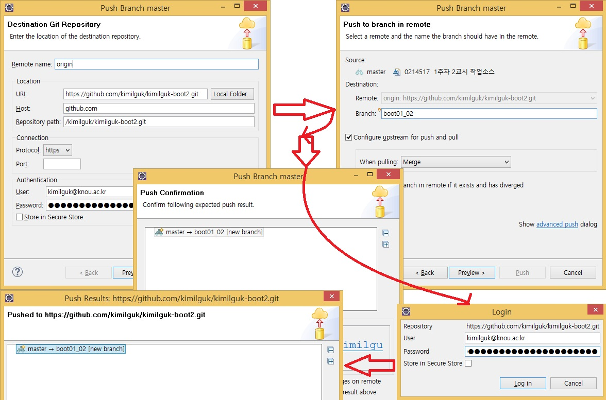

### 스프링부트와 클라우드활용 강의용 깃 소스 입니다.
#### 12주차 2교시 작업소스입니다.
- [교수의 모든 주차_교시별 강의용소스 링크](https://github.com/kimilguk/kimilguk-boot2/branches/all)

#### 아래항목은 필요한 학생만 선택해서 하세요
- 보안때문에 Token값 생성 및 사용필수(아래1단계)
- 깃허브 Settings > Developer settings 메뉴 Generate token버튼 으로 생성한 토큰 값을 복사해 놓는다.(보안때문에 깃 푸시할때 매번 입력하는것을 추천한다)

- 깃허브 저장소 만들기(아래1-2-3단계)

- 이클립스에서 Team 메뉴에서 깃허브연동 시키기(아래1-2-3단계)

- 로컬PC에 커밋:아이디는 깃아이디, 암호는 토큰값으로 로그인 후 아래 푸시처리 진행 됩니다.(아래)

- 원격 깃허브에 푸시: 깃허브 주소를 커밋설정에 붙여넣습니다.(아래)
 https://github.com/kimilguk/kimilguk-boot2
