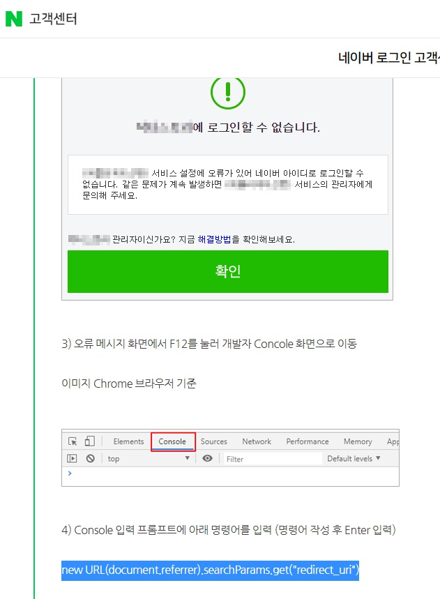

### 스프링부트와 클라우드활용 강의용 깃 소스 입니다.
#### 헤로쿠클라우드 무료정책 사용중지에 따른 구름ide 클라우드로 배포 가능한 작업소스 입니다.
- [교수의 모든 주차_교시별 강의용소스 링크](https://github.com/kimilguk/kimilguk-boot2/branches/all)
- 구름 클라우드를 사용한 결과 URL: https://kimilguk-boot-czziw.run.goorm.io/

```
그동안 잘 사용하였고, 상당히 편리하게 free dyno 호스팅 서비스와 free postgreSQL 데이터베이스를 사용할 수 있는 것이 장점 이었습니다. 9월에 학생용 지원책을 발표한다고 하는데, free 서비스가 포함되기를 바라고 있습니다.
그래서, 이번에 기존 헤로쿠용 스프링부트 프로젝트를 구름ide 클라우드용으로 마이그레이션 해 보았습니다.
기존 헤로쿠용 소스: https://github.com/kimilguk/kimilguk-boot2/tree/boot14_03
기존 헤로쿠용 배포URL(11월 이후 삭제예정): https://kimilguk-boot2.herokuapp.com/
신규 구름ide용 소스: https://github.com/kimilguk/kimilguk-boot2/tree/goormcloud
신규 구름ide용 배포URL: https://kimilguk-boot-czziw.run.goorm.io/
```

#### 구름ide 클라우드에 배포 전 아래항목을 3가지를 수정 후 진행 하시면 됩니다.
-1) src/main/resources/application.properties 파일상단 코드수정

```
중략...
#spring.profiles.include=db-postgres,oauth-heroku
spring.profiles.include=db-h2,oauth-local
#구름ide 클라우드용 추가(아래) 필요없음. 원상복구,빌드 속도를 향상시키는 역할임
#spring.jpa.open-in-view=false
중락...
#로깅레벨을 축소하면서 DB실행구문(SQL)이 나오지 않아서 추가
#단, 구름ide 클라우드에서는 false로 한다(아래) 필요없음. 원상복구
spring.jpa.show_sql=true
중략...
```

-2) src/main/resources/import.sql 파일 추가. 서버를 재시작 할 때마다 자동으로 초기화 된다.

```
DELETE FROM SIMPLE_USERS
INSERT INTO SIMPLE_USERS VALUES (1, CURRENT_TIMESTAMP, CURRENT_TIMESTAMP, true, '$2a$12$gZ.yvR4/mbCM6ev5L88NOeCh3VeH07K3c5kErn02NwrlsCRyX6fMi', 'ADMIN', 'admin')
INSERT INTO SIMPLE_USERS VALUES (2, CURRENT_TIMESTAMP, CURRENT_TIMESTAMP, true, '$2a$12$gZ.yvR4/mbCM6ev5L88NOeCh3VeH07K3c5kErn02NwrlsCRyX6fMi', 'USER', 'user')
```

-3) 프로젝트 루트 최상위의 build.gradle 에서 하단 내용 추가

```
중략...
sourceCompatibility = '8'//지정한 자바버전. 단, 구름 클라우드에서는 11을 8로 변경한다.
중략...
//단, 구름ide에서는 배포시 테스트는 제외하도록 지정(아래)
test {
    exclude '**/*'
}
//단, 구름ide에서는 KimilgukBoot2Application-plain.jar 파일까지 자동으로 생성되기 때문에 생성되지 않도록 처리한다(아래)
jar {
	enabled = false
}
```

#### 구름 ide 클라우드에 배포하기
- 우선 구름ide 클라우드에 로그인 한다. https://ide.goorm.io/ 
- 회원가입 없이 카카오 계정으로 로그인 하면 된다.(아래)
- 
- 아래 [새 컨테이너]버튼을 클릭하여 새 컨테이너를 추가한다.
- 
- 아래 이름 항목에 컨테이너 이름을 설정한다. 되도록이면 프로젝트 이름과 동일하게하는 것을 추천한다.(아래)
- 
- 작업한 깃 허브 소스와 연동 한다.(아래)
- 
- 아래 스택 중 스프링부트 스택을 선택한다.(아래)
- 
- 템플릿 중 그래들 빌더 프로젝트를 선택한다.(아래)
- 
- 강의에서는 H2와 postgreSQL DB 2가지를 사용하지만, MySQL과 mysql-ctl을 선택 후 생성하기 버튼 클릭 한다.(아래)
- 
- 아래 엡 서비스를 항상켜두기 버튼을 활성화하기 위해 정지 시킨다.
- 
- 아래 엡 서비스를 항상켜두기 버튼을 활성화 시킨 후 실행 버튼으로 컨테이너에 들어간다.
- 

- 단, 아래 구름 ide 클라우드의 스프링부트 스택은 그래들 빌드 버전이 낮기 때문에 업그레이드를 진행한다(아래)

```
- 그래들 업그레이드 설치
터미널창>>  wget https://services.gradle.org/distributions/gradle-7.1.1-bin.zip -P /tmp
터미널창>> sudo unzip -d /opt/gradle /tmp/gradle-7.1.1-bin.zip
- 환경변수 추가(구름 컨테이너 기본설정 창에서 터미널-프로필에 아래내용 추가)
export GRADLE_HOME=/opt/gradle/gradle-7.1.1
export PATH=${GRADLE_HOME}/bin:${PATH}
```
- 
- 위 작업 후 터미널에서 아래 명령으로 프로파일에 적용 시킨다.

```
source ~/.profile
```
- 아래 터미널 창에서 그래들 버전확인: 터미널>>gradle -v (아래)
- 
- 아래 창의 상단 오른쪽 [실행] 버튼의 그래들 빌드 [실행명령] 선택(아래)
- 
- 그래들 빌드 실행명령 창에서 무중단 실행을 위한 백그라운드로 실행. 아래처럼 선택한다.(아래)
- 
- 저장 후 실행 버튼을 클릭 후 5분 정도 후에 아래 노란색 부분을 클릭하면, 크롬에서 앱 화면을 볼 수 있다.(아래)
- 단, 아래처럼 왼쪽 build폴더에 lib폴더에 jar 실행파일이 만들어 질때 까지 기다려야 한다.(약 5분)
- 
- 결과 크롬 화면(아래)
- 
- 카카오개발자센터에서도 위 https://kimilguk-boot-czziw.run.goorm.io/ 도메인을 추가해서 지도를 사용할 수 있게 해준다.
- 
- 네이버개발자센터에서도 위 https://kimilguk-boot-czziw.run.goorm.io/ 도메인을 추가해서 네아로를 사용할 수 있게 해준다.
- 
- 위 콜백URL을 확인하는 방법.(아래)
- 아래 크롬 console에서 new URL(document.referrer).searchParams.get("redirect_uri")
- 
- 구름ide 터미널에서 ps -ef | grep java 로 자바로 실행중인 프로세스를 확인 후 삭제한다. kill 프로세스번호 로 삭제 후 안전한 실행을 위해 build/libs폴더의 jar를 지우고, 컨테이너 나가기 후 다시 들어온다.
- 아래 노란색 버튼으로 스프링부트 앱을 재실행 한다.(아래)
- 