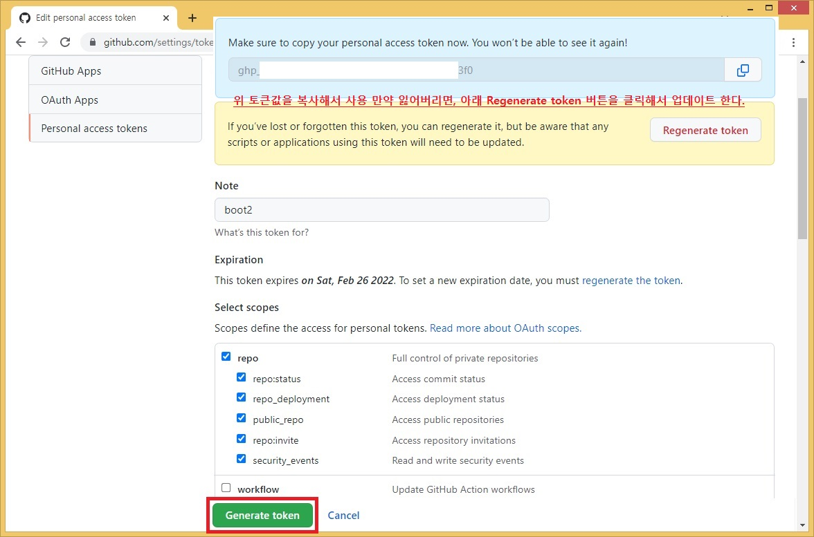
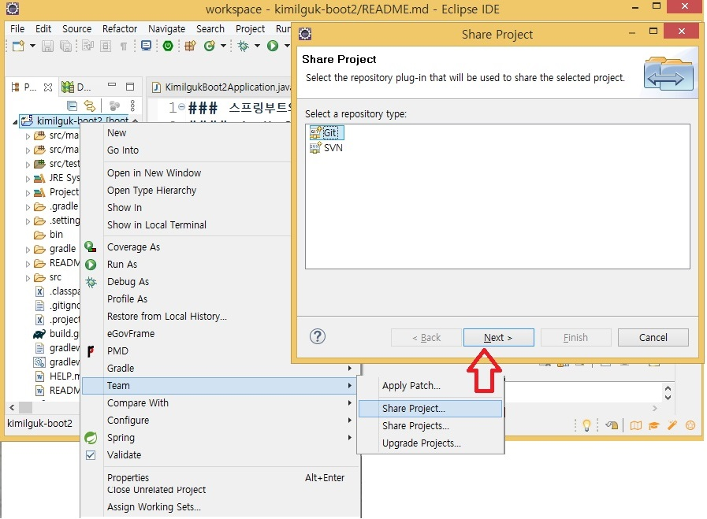

### 스프링부트와 클라우드활용 강의용 깃 소스 입니다.
#### 14주차 3교시 작업소스.
- [교수의 모든 주차_교시별 강의용소스 링크](https://github.com/kimilguk/kimilguk-boot2/branches/all)

#### 아래항목은 필요한 학생만 선택해서 하세요
- 보안때문에 Token값 생성 및 사용필수(아래1단계)
- 깃허브 Settings > Developer settings 메뉴 Generate token버튼 으로 생성한 토큰 값을 복사해 놓는다.(보안때문에 깃 푸시할때 매번 입력하는것을 추천한다)

- 깃허브 저장소 만들기(아래1-2-3단계)

- 이클립스에서 Team 메뉴에서 깃허브연동 시키기(아래1-2-3단계)

- 로컬PC에 커밋:아이디는 깃아이디, 암호는 토큰값으로 로그인 후 아래 푸시처리 진행 됩니다.(아래)

- 원격 깃허브에 푸시: 깃허브 주소를 커밋설정에 붙여넣습니다.(아래)
 https://github.com/kimilguk/kimilguk-boot2

#### 자바기본이 부족한 분들을 위한 학습자료 추가
- [자바기본학습자료 강의용소스 링크](https://github.com/kimilguk/kimilguk-boot2/tree/boot14_03/src/test/java/basic)
01) 자바기초의 시작으로 헬로월드를 출력하는 프로그램 생성한다.
 * 데이터 저장용 변수의 종류를 학습한다. 
 * Basic01_HelloWorld.java
02) 클래스와 객체의 관계 및 상속에 대해서 학습한다.(객체의 다형성)
 * Basic02_ClassMethod.java
03) 인터페이스를 상속한 클래스로 객체의 다형성을 구현한다.
 * 인터페이스(스프링에서 주로사용)를 사용하는 목적은 두꺼운책에서 목차를 만드는 것과 똑같은 역할.
 * Basic03_Interface.java
04) 반복구문에 대해서 학습한다.
 * 프로그램 흐름을 제어하는 구문중 향상된 for문 사용
 * Basic04_Loop.java
05) 프로그램 오류시 중단없이 에러를 건너띄고 실행시키는 역할을 학습한다.
 * Basic05_Exception.java
06) 싱글톤 이라는 static 속성처럼 앱 실행 시 객체로 생성되고, 1회만  객체로 만들 수 있는 클래스에 대해 학습한다.
 * 프로그램 흐름을 제어하는 구문중 if비교문 사용
 * Basic06_Singleton.java
07) 1개의 앱에 여러개의 작업=다중작업을 동시에 실행할 때 다중 스레드를 사용한다.
 * 1개의 앱은 1개의 작업=스레드로 실행된다.
 * Basic07_Thread.java
08) 주로 통신 프로그램에서 사용하는 Runnable 인터페이스를 상속한 스레드를 학습한다.
 * Basic08_Runnable.java
09) 자바8버전부터 지원하는 애로우 함수인 람다식으로 코딩을 하는방법 학습한다.
 * Basic09_Lambda.java
10) 입력,출력 스트림 클래스를 사용하여 파일 입출력을 구현한다.
 * Basic10_FileInputOutput.java
11) 데이터자료형 클래스와 서비스클래스에 대해서 학습한다.(메서드의 다형성)
 * Basic11_DataServiceClass.java
12) 오픈API 서비스에서 제공하는 JSON 목록을 출력하는 기능을 구현한다.
 * Basic12_OpenApi.java